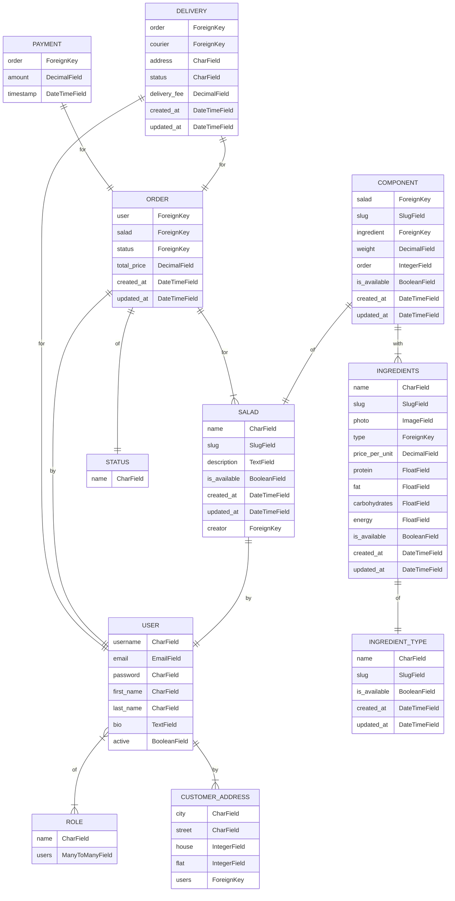
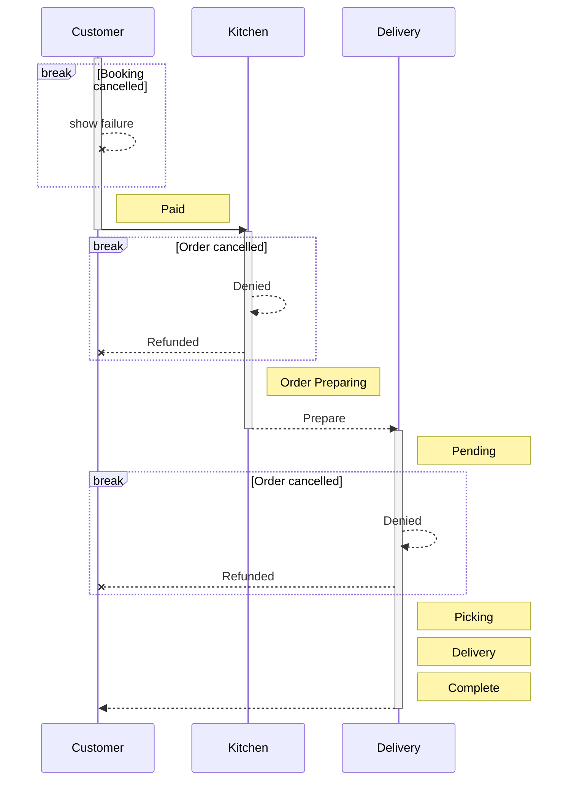
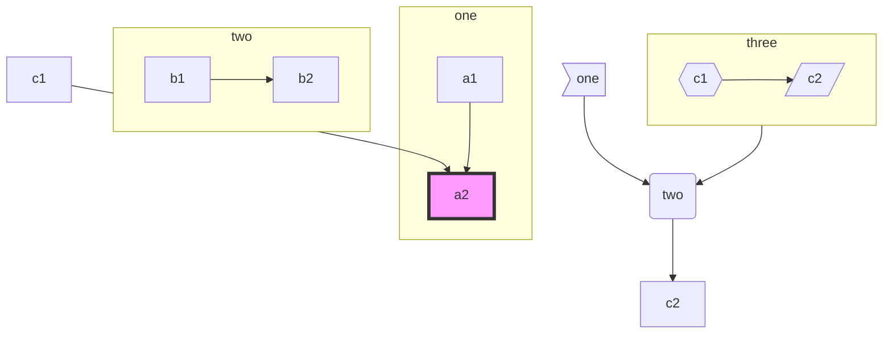

# SALATIK — Salad Delivery Project

The SALATIK Project is an innovative web application that aims to revolutionize the way people order and enjoy healthy and delicious salads. With our platform, customers can easily browse through a wide variety of salads, customize their ingredients, and have them conveniently delivered to their doorstep.

## Key Features

- **Extensive Salad Menu**: Explore an extensive menu of mouthwatering salads, ranging from classic favorites to unique creations. Each salad is carefully crafted using the freshest and finest ingredients.

- **Customization Options**: Personalize your salads to suit your taste and dietary preferences. Choose from a wide selection of ingredients, dressings, and toppings to create the perfect salad combination.

- **User Profiles**: Create your own user profile and manage your preferences. Save your favorite salad combinations for quick and easy reordering.

- **Easy Ordering Process**: Our intuitive and user-friendly interface makes it a breeze to place your salad orders. Simply select your desired salad, customize it to your liking, and proceed to checkout.

- **Delivery Tracking**: Track the status of your salad delivery in real-time. Stay informed about the estimated delivery time and receive updates on the progress of your order.

- **Secure Payment Options**: We prioritize the security of your transactions. Enjoy peace of mind with our secure and seamless payment options, ensuring that your financial information is protected.

- **Responsive Design**: Access the Salad Delivery Project from any device. Our platform is fully responsive, providing a seamless and enjoyable user experience on desktop, tablet, and mobile devices.

## Get Started

To get started with the SALATIK Project, follow these steps:

1. Clone the repository to your local machine.
2. Set up the necessary dependencies by running the installation commands.
3. Configure the database settings according to your environment.
4. Run the application using the provided command.
5. Access the application through your preferred web browser.

## Contributing

We welcome and encourage contributions to the SALATIK Project. If you have any ideas, bug reports, or feature requests, feel free to open an issue or submit a pull request. Let's collaborate to make the project even better!

## Feedback and Support

If you have any questions, feedback, or need assistance with the SALATIK Project, please don't hesitate to reach out. We're here to help and ensure that you have the best experience with our platform.

## License

The SALATIK Project is released under the [GNU General Public License (GPL)](LICENSE). Feel free to modify, distribute, and use the code for your own purposes.

---

By combining the convenience of online ordering, the freshness of premium ingredients, and the joy of enjoying a healthy meal, the Salad Delivery Project aims to make nutritious eating accessible and enjoyable for everyone. Join us on this culinary journey and elevate your salad experience to new heights!

## Architecture of the project

<picture>
  <source media="(prefers-color-scheme: dark)" srcset="http://4qd.ru/architecture.png">
  <source media="(prefers-color-scheme: light)" srcset="http://4qd.ru/architecture.png">
  
</picture>

## 1. Регистрация и авторизация

  

### 1.1 Регистрация

- Доступна система регистрации для пользователей.

- Обязательные поля: логин, пароль, email.

- Проводится валидация email при регистрации (по желанию).

  

### 1.2 Авторизация

- Пользователи могут войти в систему с использованием своего логина и пароля.

  

### 1.3 Роли пользователей

- Роли пользователей: Аноним, Сборщик, Покупатель, Курьер, Администратор.

- Администратор устанавливает роли пользователям.

  

### 1.4 Функциональность для разных ролей

#### 1.4.1. Роль «Аноним»:
   - Просмотр описаний компонентов салат и салатов.
   - Просмотр цен, фотографий, отзывов и комментариев.
   - Сбор набора для заказа.

#### 1.4.2. Роль «Аутентифицированный пользователь (заказчик)»:
   - Все возможности роли «Аноним».
   - Оформление заказа салата.
   - Просмотр сообщений от курьера или сборщика.
   - Просмотр истории заказов и их статусов.
   - Публикация отзывов и оценок для готовых салатов.
   - Комментирование чужих отзывов.
   - Редактирование и удаление собственных отзывов, комментариев и салатов.

#### 1.4.3. Роль «Сборщик»:
   - Изменение статусов заказов.
   - Изменение стоимости и количества ингредиентов на складе.
   - Редактирование описания и фотографий компонентов салатов.
   - Отправка сообщений курьеру и заказчику текущего заказа.
   - Создание задач для курьера о новых заказах.

#### 1.4.4. Роль «Курьер»:
   - Изменение статусов заказов (в пределах допустимых значений).
   - Оставление сообщений пользователю и сборщику текущего заказа.
   - Просмотр информации об адресе и местоположении заказчика.
   - Получение уведомлений о новых заказах от сборщика.

#### 1.4.5. Роль «Администратор»:
   - Полные права на управление всем контентом проекта.
   - Назначение ролей пользователям.
   - Обладает правами администратора Django и доступом к панели администрирования Django.

  

## 2. Сервисы и страницы части заказчика

  

### 2.1 Главная страница

- На главной странице отображается список рецептов салатов, отсортированных по дате публикации (от новых к старым).

  

### 2.2 Страница салата

- На странице салата отображается полное описание салата.

- Пользователи могут добавить салат в избранное.

- Пользователи могут добавить салат в список покупок.

- Пользователи могут подписаться на автора салата.

  

### 2.3 Страница пользователя

- На странице пользователя отображается личная информация пользователя (имя, почта, тел, список адресов).

- Отображаются все салаты, опубликованные пользователем.

- Пользователи могут подписаться на пользователя.

  

### 2.4 Список покупок

- Доступен только авторизованным пользователям.

- Пользователь может отмечать салаты и добавлять их в список покупок.

- На странице списка покупок отображаются все добавленные салаты.

- Пользователь может скачать список покупок в формате .txt или PDF.

- Ингредиенты в списке покупок не должны дублироваться; они должны быть суммированы.

  

### 2.5 Фильтрация по тегам

- При выборе тега отображается список салатов, отмеченных этим тегом.

- Фильтрация может быть по нескольким тегам в комбинации «или».

  

## 3. Часть системы для кухни

  

### 3.1 Управление заказами

- Система должна иметь механизм управления заказами, который позволяет кухонному персоналу видеть поступающие заказы и их статус.

- Страница управления стоимостью ингредиентов.

- Каждый заказ должен содержать информацию о салатах, которые были выбраны клиентом, и их количестве.

- Кухонный персонал должен иметь возможность просматривать и обновлять статус каждого заказа, отмечая его как "новый", "в процессе", "готов" или "выполнен".

  

### 3.2 Уведомления о новых заказах

- Кухонный персонал должен получать уведомления о поступлении новых заказов для быстрой обработки.

- Уведомления могут быть отправлены по электронной почте, через систему уведомлений внутри приложения или другими способами, удобными для кухонного персонала.

  

### 3.3 Отслеживание времени приготовления

- Система должна иметь возможность отслеживать время, затраченное на приготовление каждого салата.

- Кухонный персонал может отметить, когда салат был начат и когда он был завершен, чтобы оптимизировать процесс приготовления и соблюдать сроки выполнения заказов.

  

### 3.4 Уведомления клиентам

- Клиентам следует отправлять уведомления о состоянии и прогрессе их заказов.

- Уведомления могут содержать информацию о подтверждении заказа, о готовности заказа для самовывоза или о времени доставки.

- Уведомления могут быть отправлены по электронной почте, смс или через уведомления в приложении.

  

### 3.5 Интеграция с системой оплаты

- При необходимости система может быть интегрирована с системой оплаты, чтобы позволить клиентам оплачивать свои заказы онлайн.

- Интеграция с платежными шлюзами, такими как Яндекс, Сбер или другими, позволит принимать платежи от клиентов и автоматически подтверждать статус заказа после успешной оплаты.

  
  
  

## 4. Cписок рабочих страниц управлением заказами на кухне:

  

### 4.1. Список заказов:

- Страница, отображающая список поступающих заказов.

- Каждый заказ должен содержать информацию о клиенте, выбранных салатах и их количестве.

- Кухонный персонал может видеть статус каждого заказа (новый, в процессе, готов, выполнен).

  

### 4.2. Детали заказа:

- Страница, отображающая подробную информацию о конкретном заказе.

- Здесь должна быть доступна информация о клиенте, выбранных салатах и их количестве.

- Кухонный персонал может обновлять статус заказа и отмечать его как «в процессе», «готов» или «выполнен».

  

### 4.3. Управление временем приготовления:

- Страница, где кухонный персонал может отслеживать время приготовления каждого салата.

- Для каждого салата должны быть поля «Начало приготовления» и «Завершение приготовления», чтобы отметить время начала и окончания приготовления.

- Это поможет оптимизировать процесс приготовления и соблюдать сроки выполнения заказов.

  

### 4.4. Уведомления о новых заказах:

- Система должна отправлять уведомления кухонному персоналу о поступлении новых заказов.

- Уведомления могут быть отправлены по электронной почте, через систему уведомлений внутри приложения или другим удобным способом.

  
  
  
  

## 5. Раздел системы, связанный с работой курьера:

  

### 5.1. Список заказов для доставки:

- Страница, отображающая список заказов, требующих доставки.

- Каждый заказ должен содержать информацию о клиенте, адресе доставки и выбранных салатах.

  

### 5.2. Детали заказа:

- Страница, отображающая подробную информацию о конкретном заказе для доставки.

- Здесь должна быть доступна информация о клиенте, адресе доставки и выбранных салатах.

- Курьер может отметить заказ как «в доставке» и указать ожидаемое время доставки.

  

### 5.3. Управление статусом доставки:

- Страница, где курьер может обновлять статус доставки для каждого заказа.

- Курьер может отметить заказ как «доставлен» после выполнения доставки.

  

### 5.4. Маршрут доставки:

- Страница, предоставляющая курьеру информацию о маршруте доставки.

- Здесь должна быть отображена карта с маркерами адресов доставки для оптимального планирования маршрута.

  

### 5.5. Уведомления о новых заказах и обновлениях статуса:

- Система должна отправлять уведомления курьеру о новых заказах и изменениях статуса доставки.

- Уведомления могут быть отправлены по электронной почте, через систему уведомлений внутри приложения или другим удобным способом.

## Database design

## Orders statuses

## UML diagrams

You can render UML diagrams using [Mermaid](https://mermaidjs.github.io/). For example, this will produce a sequence diagram:

And this will produce a flow chart:

