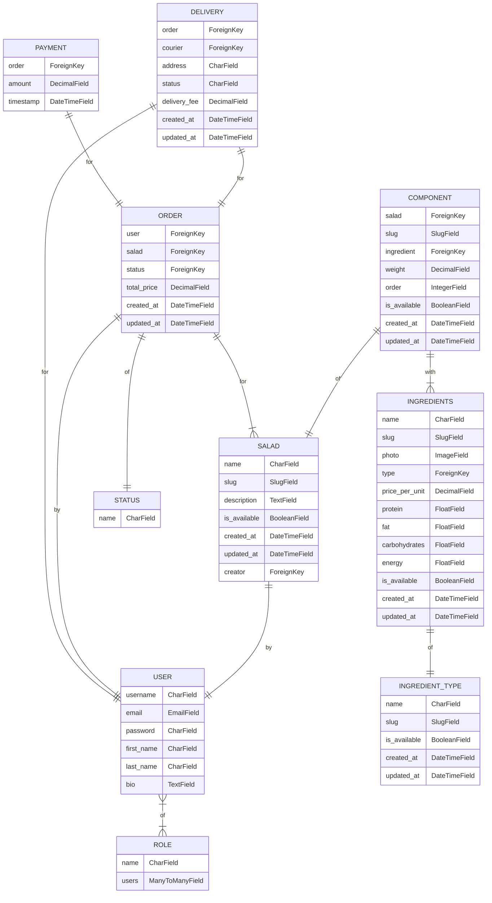
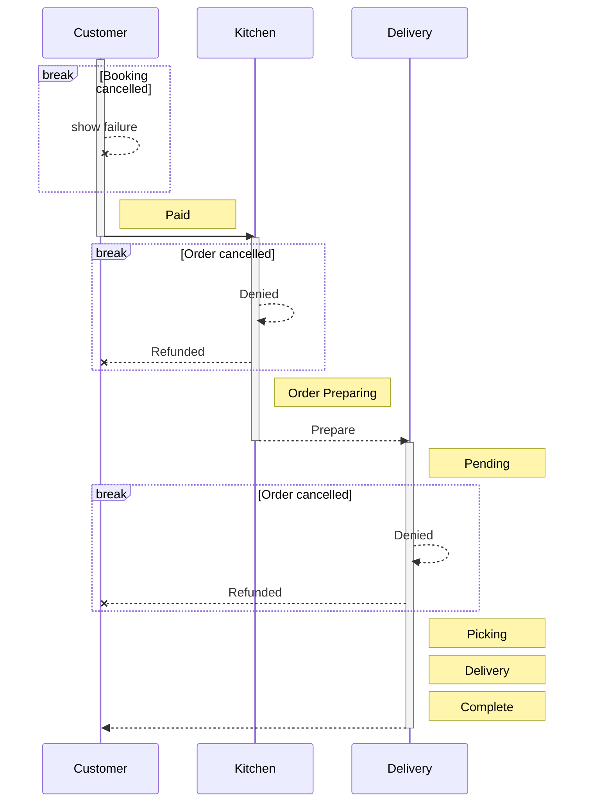

# Проект SALATIK 
> Нужен для того, чтобы заказать себе салат!


В приложении будет часть, где сборщики могут регулировать доступные ингредиенты для салатов и их наличие («Кухня»), указывать стоимость компонентов, отслеживать заказы, их статусы. Часть для курьеров с интеграцией яндекс-карт. И пользовательская часть, где можно выбрать ингредиенты для салата, указать их количество и порядок закладки, а также оформить заказ себе домой.


# Техническое задание


## 1. Регистрация и авторизация

  

### 1.1 Регистрация

- Доступна система регистрации для пользователей.

- Обязательные поля: логин, пароль, email.

- Проводится валидация email при регистрации (по желанию).

  

### 1.2 Авторизация

- Пользователи могут войти в систему с использованием своего логина и пароля.

  

### 1.3 Роли пользователей

- Роли пользователей: Аноним, Сборщик, Покупатель, Курьер, Администратор.

- Администратор устанавливает роли пользователям.

  

### 1.4 Функциональность для разных ролей


#### 1.4.1. Роль «Аноним»:
   - Просмотр описаний компонентов салат и салатов.
   - Просмотр цен, фотографий, отзывов и комментариев.
   - Сбор набора для заказа.

#### 1.4.2. Роль «Аутентифицированный пользователь (заказчик)»:
   - Все возможности роли «Аноним».
   - Оформление заказа салата.
   - Просмотр сообщений от курьера или сборщика.
   - Просмотр истории заказов и их статусов.
   - Публикация отзывов и оценок для готовых салатов.
   - Комментирование чужих отзывов.
   - Редактирование и удаление собственных отзывов, комментариев и салатов.

#### 1.4.3. Роль «Сборщик»:
   - Изменение статусов заказов.
   - Изменение стоимости и количества ингредиентов на складе.
   - Редактирование описания и фотографий компонентов салатов.
   - Отправка сообщений курьеру и заказчику текущего заказа.
   - Создание задач для курьера о новых заказах.

#### 1.4.4. Роль «Курьер»:
   - Изменение статусов заказов (в пределах допустимых значений).
   - Оставление сообщений пользователю и сборщику текущего заказа.
   - Просмотр информации об адресе и местоположении заказчика.
   - Получение уведомлений о новых заказах от сборщика.

#### 1.4.5. Роль «Администратор»:
   - Полные права на управление всем контентом проекта.
   - Назначение ролей пользователям.
   - Обладает правами администратора Django и доступом к панели администрирования Django.


  

## 2. Сервисы и страницы части заказчика

  

### 2.1 Главная страница

- На главной странице отображается список рецептов салатов, отсортированных по дате публикации (от новых к старым).

  

### 2.2 Страница салата

- На странице салата отображается полное описание салата.

- Пользователи могут добавить салат в избранное.

- Пользователи могут добавить салат в список покупок.

- Пользователи могут подписаться на автора салата.

  

### 2.3 Страница пользователя

- На странице пользователя отображается имя пользователя.

- Отображаются все салаты, опубликованные пользователем.

- Пользователи могут подписаться на пользователя.

  

### 2.4 Список покупок

- Доступен только авторизованным пользователям.

- Пользователь может отмечать салаты и добавлять их в список покупок.

- На странице списка покупок отображаются все добавленные салаты.

- Пользователь может скачать список покупок в формате .txt или PDF.

- Ингредиенты в списке покупок не должны дублироваться; они должны быть суммированы.

  

### 2.5 Фильтрация по тегам

- При выборе тега отображается список салатов, отмеченных этим тегом.

- Фильтрация может быть по нескольким тегам в комбинации «или».

  


## 3. Часть системы для кухни

  

### 3.1 Управление заказами

- Система должна иметь механизм управления заказами, который позволяет кухонному персоналу видеть поступающие заказы и их статус.

- Каждый заказ должен содержать информацию о салатах, которые были выбраны клиентом, и их количестве.

- Кухонный персонал должен иметь возможность просматривать и обновлять статус каждого заказа, отмечая его как "новый", "в процессе", "готов" или "выполнен".

  

### 3.2 Уведомления о новых заказах

- Кухонный персонал должен получать уведомления о поступлении новых заказов для быстрой обработки.

- Уведомления могут быть отправлены по электронной почте, через систему уведомлений внутри приложения или другими способами, удобными для кухонного персонала.

  

### 3.3 Отслеживание времени приготовления

- Система должна иметь возможность отслеживать время, затраченное на приготовление каждого салата.

- Кухонный персонал может отметить, когда салат был начат и когда он был завершен, чтобы оптимизировать процесс приготовления и соблюдать сроки выполнения заказов.

  

### 3.4 Уведомления клиентам

- Клиентам следует отправлять уведомления о состоянии и прогрессе их заказов.

- Уведомления могут содержать информацию о подтверждении заказа, о готовности заказа для самовывоза или о времени доставки.

- Уведомления могут быть отправлены по электронной почте, смс или через уведомления в приложении.

  

### 3.5 Интеграция с системой оплаты

- При необходимости система может быть интегрирована с системой оплаты, чтобы позволить клиентам оплачивать свои заказы онлайн.

- Интеграция с платежными шлюзами, такими как Stripe, PayPal или другими, позволит принимать платежи от клиентов и автоматически подтверждать статус заказа после успешной оплаты.

  
  
  

## 4. Cписок рабочих страниц управлением заказами на кухне:

  

### 4.1. Список заказов:

- Страница, отображающая список поступающих заказов.

- Каждый заказ должен содержать информацию о клиенте, выбранных салатах и их количестве.

- Кухонный персонал может видеть статус каждого заказа (новый, в процессе, готов, выполнен).

  

### 4.2. Детали заказа:

- Страница, отображающая подробную информацию о конкретном заказе.

- Здесь должна быть доступна информация о клиенте, выбранных салатах и их количестве.

- Кухонный персонал может обновлять статус заказа и отмечать его как "в процессе", "готов" или "выполнен".

  

### 4.3. Управление временем приготовления:

- Страница, где кухонный персонал может отслеживать время приготовления каждого салата.

- Для каждого салата должны быть поля "Начало приготовления" и "Завершение приготовления", чтобы отметить время начала и окончания приготовления.

- Это поможет оптимизировать процесс приготовления и соблюдать сроки выполнения заказов.

  

### 4.4. Уведомления о новых заказах:

- Система должна отправлять уведомления кухонному персоналу о поступлении новых заказов.

- Уведомления могут быть отправлены по электронной почте, через систему уведомлений внутри приложения или другим удобным способом.

  
  
  
  

## 5. Раздел системы, связанный с работой курьера:

  

### 5.1. Список заказов для доставки:

- Страница, отображающая список заказов, требующих доставки.

- Каждый заказ должен содержать информацию о клиенте, адресе доставки и выбранных салатах.

  

### 5.2. Детали заказа:

- Страница, отображающая подробную информацию о конкретном заказе для доставки.

- Здесь должна быть доступна информация о клиенте, адресе доставки и выбранных салатах.

- Курьер может отметить заказ как "в доставке" и указать ожидаемое время доставки.

  

### 5.3. Управление статусом доставки:

- Страница, где курьер может обновлять статус доставки для каждого заказа.

- Курьер может отметить заказ как "доставлен" после выполнения доставки.

  

### 5.4. Маршрут доставки:

- Страница, предоставляющая курьеру информацию о маршруте доставки.

- Здесь должна быть отображена карта с маркерами адресов доставки для оптимального планирования маршрута.

  

### 5.5. Уведомления о новых заказах и обновлениях статуса:

- Система должна отправлять уведомления курьеру о новых заказах и изменениях статуса доставки.

- Уведомления могут быть отправлены по электронной почте, через систему уведомлений внутри приложения или другим удобным способом.

## Архитектура проекта

<picture>
  <source media="(prefers-color-scheme: dark)" srcset="http://4qd.ru/architecture.png">
  <source media="(prefers-color-scheme: light)" srcset="http://4qd.ru/architecture.png">
  
</picture>


## Схема базы данных



## Статусы заказов




 - [x] trewtrewy
 - [ ] wetret
 - [ ] List item


```
код
код
код
```

[Contribution guidelines for this project](docs/CONTRIBUTING.md)


1. First list item
   - First nested list item
     - Second nested list item


|                |ASCII                          |HTML                         |
|----------------|-------------------------------|-----------------------------|
|Single backticks|`'Isn't this fun?'`            |'Isn't this fun?'            |
|Quotes          |`"Isn't this fun?"`            |"Isn't this fun?"            |
|Dashes          |`-- is en-dash, --- is em-dash`|-- is en-dash, --- is em-dash|


## KaTeX

You can render LaTeX mathematical expressions using [KaTeX](https://khan.github.io/KaTeX/):

The *Gamma function* satisfying $\Gamma(n) = (n-1)!\quad\forall n\in\mathbb N$ is via the Euler integral

$$
\Gamma(z) = \int_0^\infty t^{z-1}e^{-t}dt\,.
$$

> You can find more information about **LaTeX** mathematical expressions [here](http://meta.math.stackexchange.com/questions/5020/mathjax-basic-tutorial-and-quick-reference).


## UML diagrams

You can render UML diagrams using [Mermaid](https://mermaidjs.github.io/). For example, this will produce a sequence diagram:


And this will produce a flow chart:


