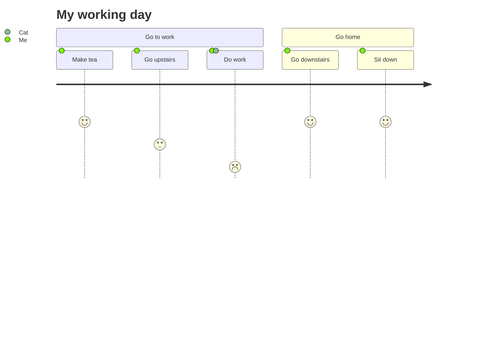
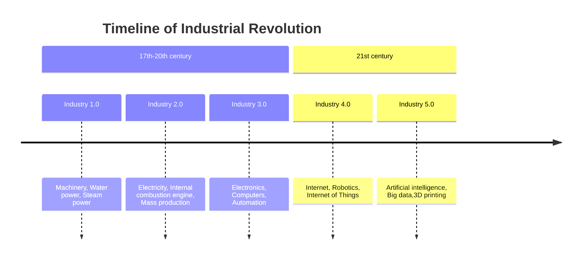

# Проект SALATIK 

> Нужен для того, чтобы заказать себе салат!

В приложении будет часть, где администраторы могут регулировать доступные ингредиенты для салатов и их наличие (склад), указывать стоимость компонентов, отслеживать заказы, их статусы. Часть для курьеров с интеграцией яндекс-карт. И пользовательская часть, где можно выбрать ингредиенты для салата, указать их количество и порядок закладки, а также оформить заказ себе домой.


# Техническое задание

## Введение

**Цель проекта**

Разработать приложение заказа салата с доставкой для администратора, пользователей и курьеров.

<details>  
<summary>1. Основные функциональные требования</summary>

  
-   Администратор должен иметь возможность управлять компонентами, их наличием и статусом заказов.    
-   Пользователь должен иметь возможность выбирать компоненты, указывать количество и порядок их закладывания, оформлять заказ и просматривать свои заказы.    
-   Курьер должен иметь возможность просматривать данные о заказе, местоположение клиента на карте и обновлять статус заказа.
</details> 
  
  
<details>  
<summary>2. Требования к функциональности</summary>

  
**2.1. Администраторская часть**

-   Авторизация администратора
-   Управление компонентами  
-- *Добавление, редактирование и удаление компонентов с указанием названия, фотографии, описания и массы в наличии.*  
-- *Просмотр списка компонентов с указанием их текущего количества.*
-   Управление заказами
-- *Просмотр списка заказов с указанием статуса и деталей заказа.*
-- *Изменение статуса заказа (например, «в обработке», «готовится», «доставляется», «доставлен», «отменён»).*

**2.2. Пользовательская часть**

- Регистрация и аутентификация пользователей.    
- Просмотр списка доступных компонентов с указанием их массы в наличии.    
- Выбор компонентов, указание количества и порядка их закладывания в салат.    
- Оформление заказа с указанием адреса доставки и выбором оплаты.    
- Просмотр списка собственных заказов с указанием статуса и деталей заказа.

**2.3. Курьерская часть**

- Авторизация курьера.    
- Просмотр списка заказов, которые требуется доставить.    
- Просмотр подробной информации о заказе, включая адрес доставки и контактные данные клиента.    
- Обновление статуса заказа (например, «взят в доставку», «доставлен клиенту»).
</details>


<details>
<summary>3. Технические требования</summary>

  
- Фреймворк: Django.    
- Язык программирования: Python.    
- База данных: PostgreSQL.

- Интерфейс администратора должен быть реализован с использованием специальных представлений (views) и шаблонов (templates).
- Возможность добавления, редактирования и удаления компонентов, указание их наличия (массы на складе), цены (за единицу массы).    
- Возможность управления заказами (просмотр и редактирование статусов).
-  Пользовательский интерфейс должен быть разработан с использованием HTML, CSS и JavaScript. Для упрощения разработки пользовательского интерфейса можно использовать фреймворк Bootstrap или другие CSS-фреймворки.    
- Реализация функциональности выбора компонентов и оформления заказа должна быть выполнена с помощью Django-форм или JavaScript для динамического добавления и удаления компонентов.    
- Для отображения местоположения клиента на карте в курьерской части можно использовать интеграцию с сервисами карт, такими как Google Maps или Яндекс.Карты.    
- Для обработки платежей можно использовать платежные шлюзы, такие как ЮMoney, Сбер или ВК. Интеграция с выбранным платежным шлюзом должна быть выполнена в соответствии с их документацией.    
- Для обновления статуса заказа и отслеживания его выполнения в реальном времени можно использовать WebSocket-соединения или технологию Server-Sent Events (SSE).    
- Приложение должно быть развернуто на сервере с использованием соответствующих настроек и конфигурации для Django приложений.


</details>

## Архитектура проекта

<picture>
  <source media="(prefers-color-scheme: dark)" srcset="http://4qd.ru/architecture.png">
  <source media="(prefers-color-scheme: light)" srcset="http://4qd.ru/architecture.png">
  
</picture>


## Схема базы данных


 - [x] trewtrewy
 - [ ] wetret
 - [ ] List item


```
код
код
код
```

[Contribution guidelines for this project](docs/CONTRIBUTING.md)


1. First list item
   - First nested list item
     - Second nested list item


|                |ASCII                          |HTML                         |
|----------------|-------------------------------|-----------------------------|
|Single backticks|`'Isn't this fun?'`            |'Isn't this fun?'            |
|Quotes          |`"Isn't this fun?"`            |"Isn't this fun?"            |
|Dashes          |`-- is en-dash, --- is em-dash`|-- is en-dash, --- is em-dash|


## KaTeX

You can render LaTeX mathematical expressions using [KaTeX](https://khan.github.io/KaTeX/):

The *Gamma function* satisfying $\Gamma(n) = (n-1)!\quad\forall n\in\mathbb N$ is via the Euler integral

$$
\Gamma(z) = \int_0^\infty t^{z-1}e^{-t}dt\,.
$$

> You can find more information about **LaTeX** mathematical expressions [here](http://meta.math.stackexchange.com/questions/5020/mathjax-basic-tutorial-and-quick-reference).


## UML diagrams

You can render UML diagrams using [Mermaid](https://mermaidjs.github.io/). For example, this will produce a sequence diagram:


And this will produce a flow chart:






